# Pyramid

Pyramid is a collaborative task and workspace management application for
organizing tasks, projects, members, comments, subtasks, resources,
notifications, and workspace activity in one place.

## Features

### Authentication

-   Continue as Guest
-   Google login
-   Google account data is associated with the user's Google ID
-   Guest/profile information is persisted for the workspace experience

### Workspace & Members

-   Workspace-based task management
-   Workspace member management and member search
-   Add/remove members from tasks where permitted
-   Workspace access controls
-   Leave Workspace option from Profile settings

### Task Management

-   Create, edit, and delete tasks
-   Title and description
-   Status and priority
-   Due date and labels
-   Task reporter
-   Task members
-   Task dates
-   Task count
-   Status changes
-   Drag and drop tasks between status columns to change status

### Task Views

-   List view
-   Board view
-   Search tasks
-   Filters
-   Fields menu for controlling visible information
-   Priority, Members, Due Date, Labels, Status, and Reporter fields

### Subtasks

-   Create subtasks under tasks
-   Display subtasks inside task details
-   Subtask priority, members, and due dates
-   Projects page can show the parent task of a subtask

### Task Settings & Permissions

Task settings allow an administrator/creator to control: - **Allow
members to add members** --- members can add other workspace members to
the task. - **Allow members to create subtasks** --- members can create
subtasks under the task. - **Allow members to comment** --- members can
add comments and replies.

### Comments & Replies

-   Task comments
-   Replies
-   Comment permission control

### Resources

-   Add documents/resources to a task
-   Uploaded resources are shown in the Resources section
-   File name and file type are displayed
-   PDF resources display a PDF indicator

### Notifications

-   Notifications for task/workspace activity
-   Notification when added to a task
-   Notification when removed from a task
-   Unread count
-   Mark all as read

### Real-Time Updates

-   Real-time task/workspace updates using WebSockets
-   Updates can appear without a full page refresh

### Projects

-   Projects page
-   Parent-task information for subtasks

### Profile

-   Profile picture/avatar
-   Full name
-   Email
-   Title/role
-   Username
-   Save profile changes
-   Workspace access
-   Leave Workspace

### Theme & Appearance

-   Light theme
-   Dark theme
-   Color mode/accent selection
-   Theme and accent preferences are persisted locally

### UI/UX

-   Workspace sidebar
-   Task cards and status columns
-   Task details panel
-   Modal-based interactions
-   Search, filters, fields, and notifications
-   Drag-and-drop task workflow

## Screenshots

### Login

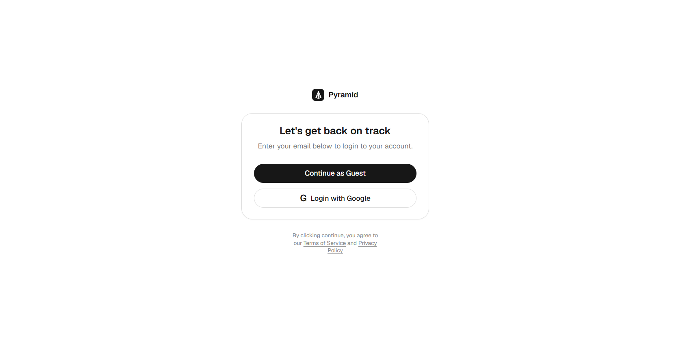

### Create Task


### Task Fields

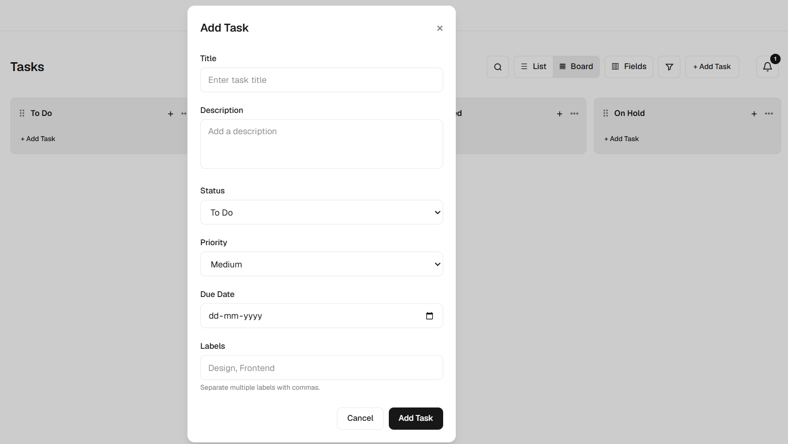

### Notifications

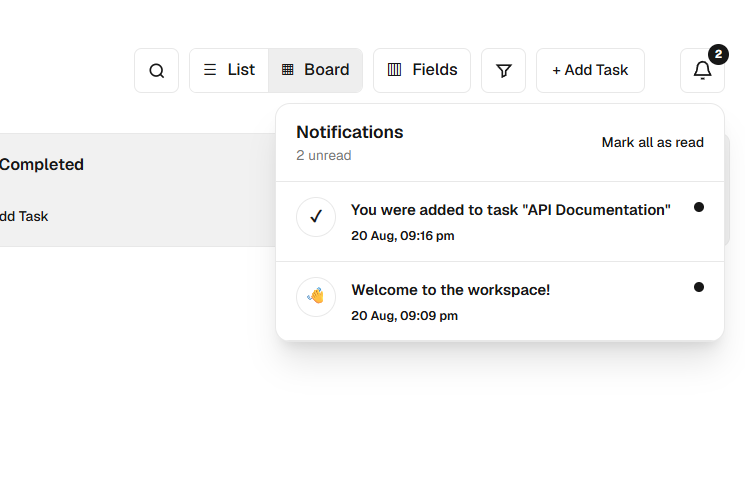

### Theme Selection

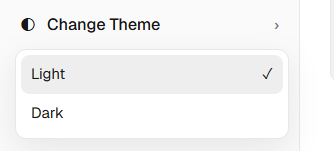

### Dark Theme

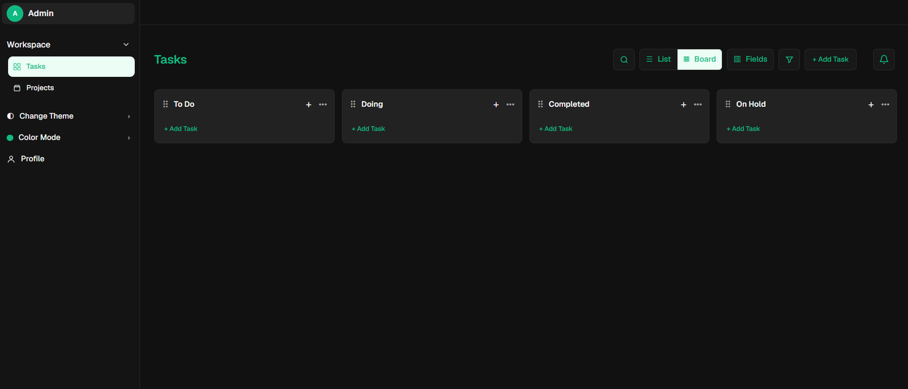

### Task Details

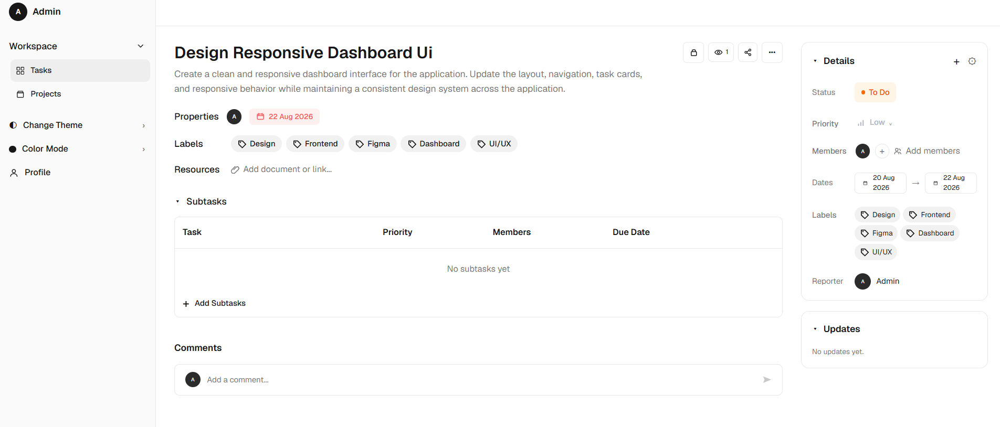

### Task Settings

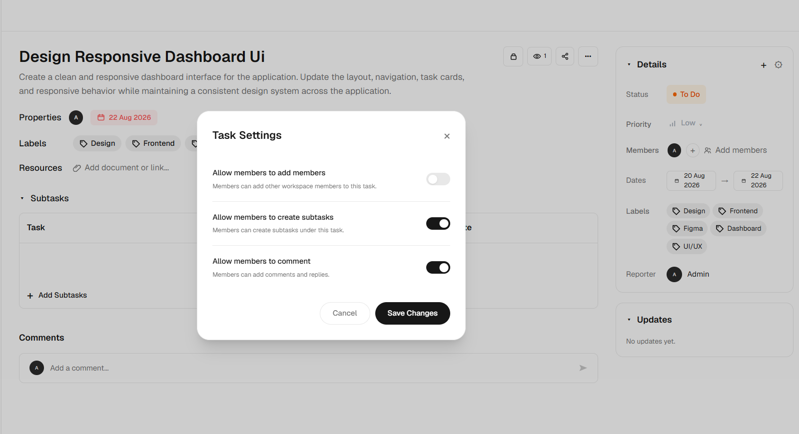

### Subtasks

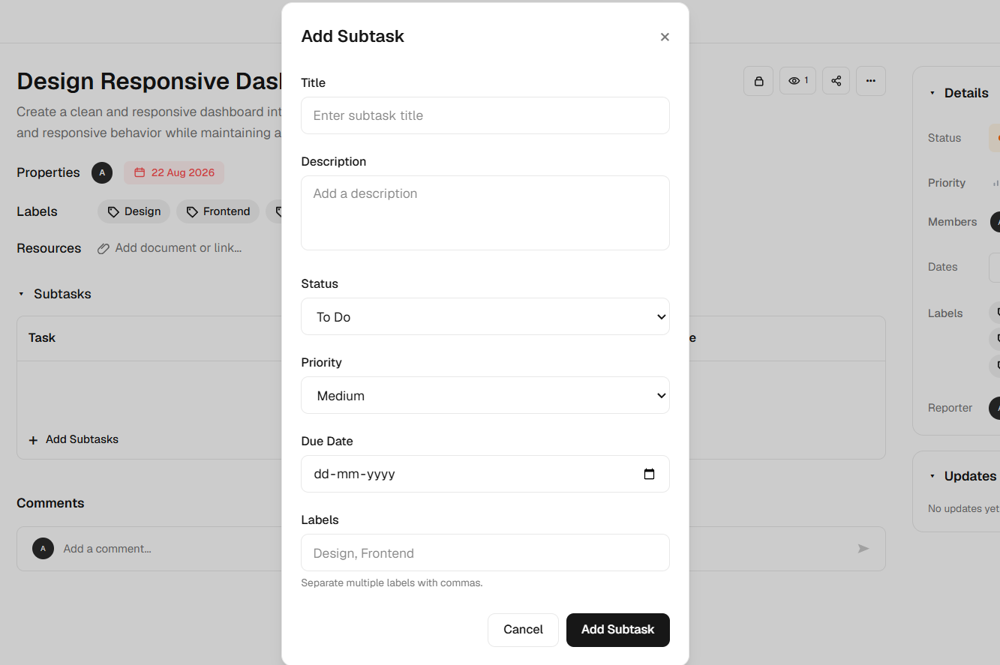
[Profile](screenshots/10.png)

### Add / Remove Members

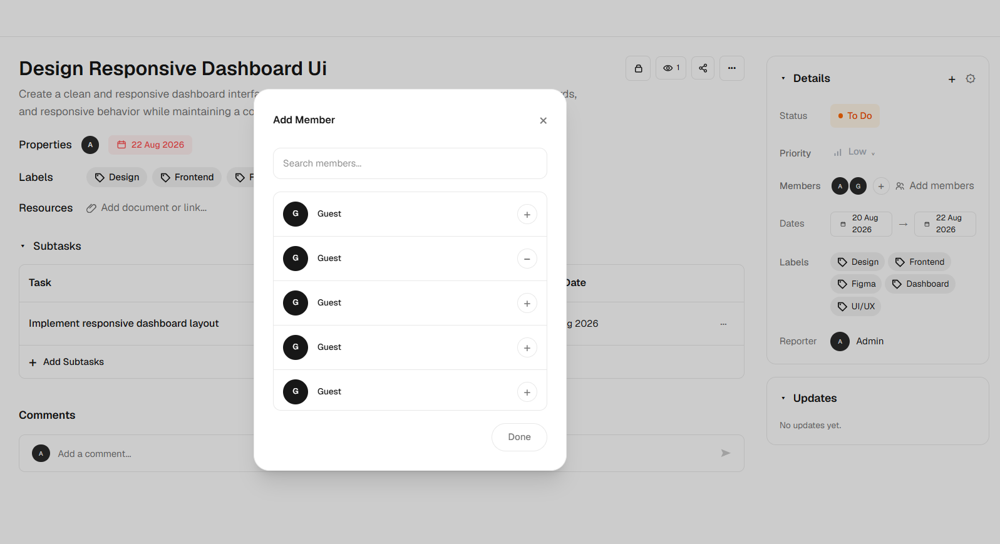


### Comments & Replies

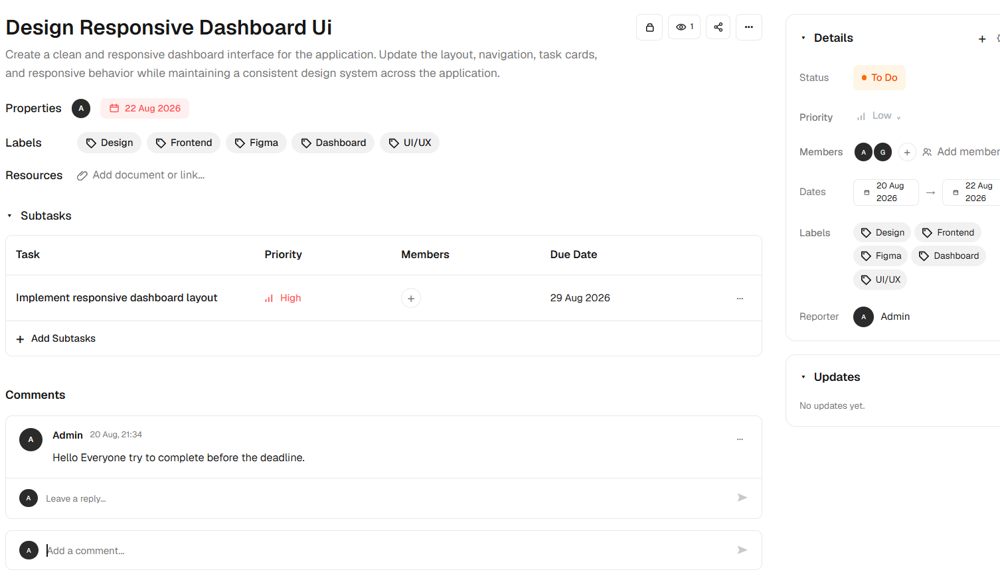

### Updates

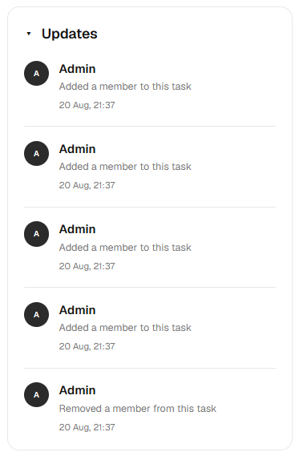

### Profile / Setting

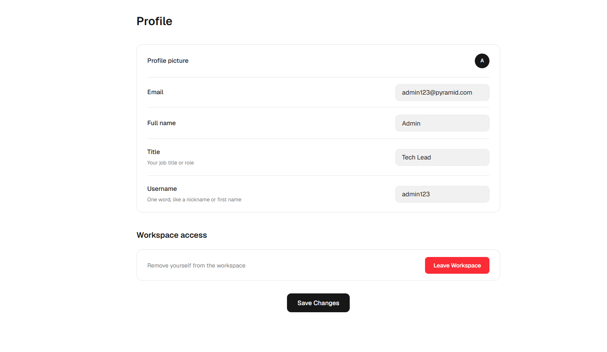


### Leave Workspace

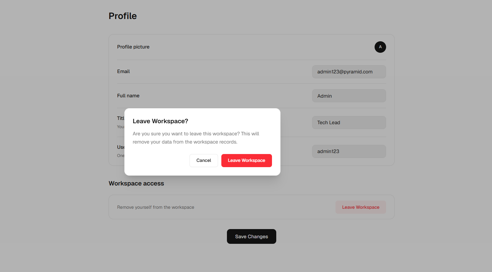


## Tech Stack

### Frontend

-   Next.js
-   React
-   TypeScript
-   Tailwind CSS

### Backend

-   NestJS
-   TypeScript
-   MongoDB
-   Mongoose
-   WebSockets

### Client Side

-   Local Storage for persisted guest/profile and UI preferences
-   WebSocket-based real-time updates

## Project Structure

``` text
pyramid/
├── frontend/
│   ├── app/
│   ├── components/
│   └── package.json
├── backend/
│   ├── src/
│   │   ├── auth/
│   │   ├── tasks/
│   │   ├── workspace-members/
│   │   └── ...
│   └── package.json
├── screenshots/
└── README.md
```

> Update the folder names if your repository uses different
> frontend/backend directory names.

## Getting the Project from GitHub

Clone the repository:

``` bash
git clone <YOUR_GITHUB_REPOSITORY_URL>
cd <PROJECT_FOLDER>
```

Install frontend dependencies:

``` bash
cd frontend
npm install
```

Install backend dependencies:

``` bash
cd ../backend
npm install
```

## Environment Variables

Create the required `.env` files for the frontend and backend.

Use the environment variable names already defined by the project. Do
not commit secrets such as MongoDB connection strings, Google OAuth
credentials, API secrets, or production credentials.

If the repository contains `.env.example`:

``` bash
cp .env.example .env
```

On Windows PowerShell:

``` powershell
Copy-Item .env.example .env
```

Then fill in the required values.

## Run the Backend

From the backend directory:

``` bash
npm run start:dev
```

## Run the Frontend

Open another terminal:

``` bash
cd frontend
npm run dev
```

Then open the local URL shown by Next.js, commonly:

``` text
http://localhost:3000
```

## Production Build

Frontend:

``` bash
npm run build
npm run start
```

For the backend, use the production scripts defined in its
`package.json`.

## Basic Usage

1.  Open the application.
2.  Continue as Guest or use Google login.
3.  Enter the workspace.
4.  Create a task with **Add Task**.
5.  Set title, description, status, priority, due date, and labels.
6.  Open the task details page.
7.  Add members, subtasks, resources, comments, and replies.
8.  Use List or Board view.
9.  Search/filter tasks and control visible fields.
10. Drag tasks between status columns.
11. Check Notifications for task/workspace activity.
12. Manage Light/Dark and Color Mode.
13. Update personal information from Profile.
14. Leave the workspace from Profile → Workspace access when required.

## Task Workflow

``` text
Create Task
    ↓
Set Status / Priority / Dates
    ↓
Add Members / Labels
    ↓
Add Subtasks / Resources / Comments
    ↓
Manage through List or Board
    ↓
Drag & Drop to change Status
    ↓
Track Updates & Notifications
```

## Notes

-   Environment configuration depends on the repository's actual `.env`
    keys.
-   Keep backend secrets out of GitHub.
-   If npm script names differ, use the scripts defined in each
    `package.json`.
